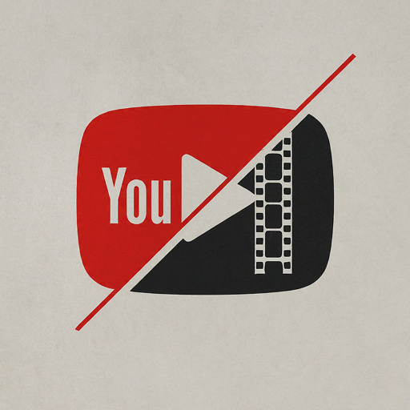
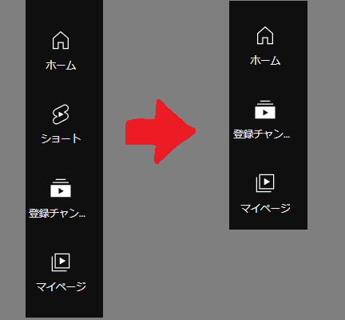

# YouTube Shorts タブ削除拡張機能

この拡張機能は、YouTubeのサイドバーから「ショート」タブを削除します。YouTubeのインターフェースをシンプルに保ち、不要なコンテンツを非表示にすることができます。

## 機能

- YouTubeのサイドバーから「ショート」タブを自動的に削除
- ページロード時および動的コンテンツの更新時に対応
- シンプルで軽量な設計

## インストール方法

1. [Releaseページ](https://github.com/yourusername/remove-youtube-shorts-tab/releases)から最新版をダウンロードして、適当な場所に解凍します。
2. ブラウザの拡張機能管理ページを開きます。
    - Chromeの場合: `chrome://extensions/`
    - Firefoxの場合: `about:addons`
3. 「デベロッパーモード」を有効にします（Chromeの場合）。
4. 「パッケージ化されていない拡張機能を読み込む」または「デバッグ用アドオンを読み込む」をクリックし、ダウンロードしたフォルダを選択します。

## 使い方

1. 拡張機能をインストールした後、YouTubeのページを開きます。
2. サイドバーから「ショート」タブが自動的に削除されます。
3. 動的にコンテンツが更新されても、「ショート」タブは表示されません。

## 注意事項

- この拡張機能は、YouTubeのインターフェースが変更された場合に動作しない可能性があります。その場合は、拡張機能の更新をお待ちください。
- この拡張機能は、個人の使用を目的としており、YouTubeの利用規約に違反しない範囲で使用してください。

## ライセンス

このプロジェクトはMITライセンスの下で公開されています。詳細は`LICENSE`ファイルを参照してください。
